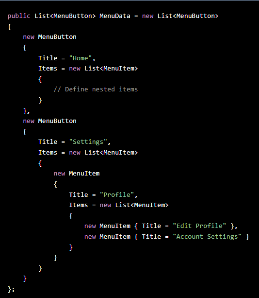
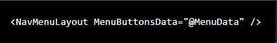
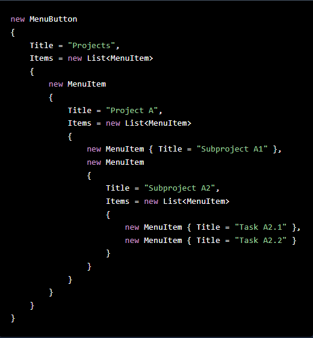

# Blazor-Nav-Menu-Component

This repository contains a Blazor component designed to implement a dynamic and customizable navigation menu system using recursive rendering for limitless nested dropdowns. The project architecture consists of two Blazor projects: one for the component itself and another for a web application that demonstrates its use.

Projects

 • Component Project: Contains the core menu component implementation with classes MenuButton and MenuItem. It also includes Layout.razor pages for the layout of the navigation menu.

 • Web App Project: Provides an example web application demonstrating how to integrate and use the menu component.

    
Component Features

 • Recursive Menu Structure: Supports root buttons with dropdown and dropright items, allowing for unlimited nesting through a recursive approach.
    
 • Data-Driven: Accepts dynamic data via the MenuButtonsData parameter to populate the menu structure.
    
 • Reusable: Can be easily integrated into any Blazor page by referencing the component.

    
Usage

Component Integration

To use the navigation menu component in your Blazor application, follow these steps:

1. Define Menu Data: Create a list of MenuButton objects representing your menu structure. Each MenuButton can contain a list of child MenuItem objects for nested dropdowns.
   
    
   
2. Include the Component: Add the **&lt;NavMenuLayout&gt;** component to your desired page, passing the menu data via the MenuButtonsData parameter.

    

Example of Limitless Nested Dropdown Items 
The recursive nature of the component allows you to nest dropdown items indefinitely. Simply continue adding MenuItem objects within each item to achieve the desired structure.

   
